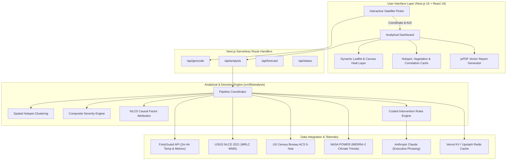

# 🌐 HeatLens — Urban Heat Island Intelligence & Climate Adaptation Platform

[](https://fortyguard.com)
[-black?style=for-the-badge&logo=next.js)](https://nextjs.org/)
[](https://react.dev/)
[](https://www.typescriptlang.org/)
[](https://tailwindcss.com/)
[](LICENSE)

> **HeatLens** is a decision-grade urban microclimate intelligence platform engineered for city sustainability offices, urban planners, public health agencies, and municipal resilience leaders. By fusing high-resolution spatial temperature telemetry, satellite land-cover diagnostics, and socio-economic census data, HeatLens detects hyperlocal heat islands, isolates their root physical causes, and formulates costed, high-impact cooling interventions.

---

## 📌 Table of Contents

- [The Challenge](#-the-challenge)
- [The HeatLens Solution](#-the-heatlens-solution)
- [System Architecture](#-system-architecture)
- [Core Feature Highlights](#-core-feature-highlights)
- [Scientific Methodology & Data Pipeline](#-scientific-methodology--data-pipeline)
  - [1. Spatial Hotspot & Cool Zone Clustering](#1-spatial-hotspot--cool-zone-clustering)
  - [2. Multi-Factor Severity Index](#2-multi-factor-severity-index)
  - [3. Causal Attribution Engine](#3-causal-attribution-engine)
  - [4. Costed Cooling Interventions](#4-costed-cooling-interventions)
- [User Experience & Workflow](#-user-experience--workflow)
- [Data Sources & Provenance](#-data-sources--provenance)
- [Tech Stack](#-tech-stack)
- [Quick Start](#-quick-start)
- [Configuration & Environment Variables](#-configuration--environment-variables)
- [Production Deployment](#-production-deployment)
- [License & Acknowledgments](#-license--acknowledgments)

---

## 🌡️ The Challenge

Urban Heat Islands (UHIs) represent one of the most severe climate risks facing modern cities:
- **Intra-Urban Disparities**: Adjacent city blocks can vary by up to **$10^\circ\text{C}$ ($18^\circ\text{F}$)** depending on tree canopy, impervious pavement, and building density.
- **Data Fragmentation**: Coarse satellite thermal data (often 1 km+ resolution) misses street-level microclimates, while demographic vulnerability indices exist in separate data silos.
- **Actionability Gap**: Urban planning teams frequently lack automated tools to translate temperature anomalies into quantified, costed cooling interventions with predicted cooling ROI ($\Delta T$).

---

## 💡 The HeatLens Solution

HeatLens bridges raw microclimate telemetry and municipal action through an integrated four-stage analytical pipeline:

1. **Hyperlocal Measurement**: Visualizes 2-metre air temperature at 60–100 m resolution via FortyGuard API over high-resolution satellite basemaps.
2. **Automated Anomaly Extraction**: Watershed and spatial clustering algorithms isolate high-risk hotspots and cooling corridors.
3. **Multi-Source Causal Attribution**: Samples USGS NLCD 2021 land cover (canopy deficit, impervious surface ratio, and built density) at 5 spatial coordinates per hotspot to determine *why* the area is overheating.
4. **Actionable Mitigation Planning**: Computes prioritized cooling interventions (e.g., high-albedo cool roofs, street tree planting, bioswales, pocket parks) with realistic near-surface air temperature drops ($\Delta T$), budget estimates, and implementation timelines.

---

## 🏗️ System Architecture



---

## ✨ Core Feature Highlights

| Feature | Description |
| :--- | :--- |
| 🛰️ **Interactive Satellite Workspace** | Search any US street address or navigate via high-res Esri imagery to analyze a 1.2 km microclimate zone. |
| 🌡️ **Dynamic Thermal Heatmap** | Continuous Canvas color ramp (ColorBrewer RdYlBu) tuned to the local area's specific temperature distribution. |
| 🎯 **Automated Anomaly Extraction** | Identifies critical thermal hotspots and natural cooling corridors with spatial coordinates and area footprints. |
| 🌳 **Vegetation & Canopy Insights** | Quantifies canopy coverage, tree deficits, park proximity, and identifies high-priority greening opportunities. |
| 🏢 **Urban Material Correlations** | Cross-references building density, impervious surface ratios, and structural materials driving heat retention. |
| 💰 **Costed Cooling Interventions** | Practical, engineer-vetted cooling actions with estimated near-surface cooling ($\Delta T$), budget tiers, and timelines. |
| 📄 **Executive PDF Briefing Generator** | Instant vector-quality PDF report complete with map snapshots, metric summaries, and audit-ready data provenance. |
| 🛡️ **Zero-Friction Fallback** | Deterministic simulation fallback ensures the application runs smoothly for demonstration even without live API credentials. |

---

## 🔬 Scientific Methodology & Data Pipeline

### 1. Spatial Hotspot & Cool Zone Clustering
A grid cell is flagged as a thermal anomaly when its air temperature exceeds the Area of Interest (AOI) mean by at least one standard deviation:
$$T_{\text{cell}} \ge \mu_{\text{AOI}} + 1.0 \cdot \sigma_{\text{AOI}}$$
Flagged contiguous cells are clustered using spatial watershed peak detection. Noise clusters ($<3$ cells) are pruned, ensuring intervention recommendations target actionable geographic areas.

### 2. Multi-Factor Severity Index
Every hotspot is scored on a normalized scale ($0.0 - 1.0$) combining physical thermal metrics with demographic vulnerability:
$$\text{Severity} = w_1 \cdot Z_{\text{thermal}} + w_2 \cdot D_{\text{exposure}} + w_3 \cdot H_{\text{absolute}} + w_4 \cdot V_{\text{census}}$$
- **$Z_{\text{thermal}}$**: Local thermal intensity ($z$-score).
- **$D_{\text{exposure}}$**: Hours exceeding $32.2^\circ\text{C}$ ($90^\circ\text{F}$) NWS Caution threshold.
- **$H_{\text{absolute}}$**: Peak temperature normalized against NWS Danger bands.
- **$V_{\text{census}}$**: Socio-economic vulnerability (elderly population %, poverty rate, vehicle access).

### 3. Causal Attribution Engine
For each detected hotspot, 5 geographic coordinates (centroid + 4 quadrant points) query USGS NLCD 2021 multi-band rasters to isolate the relative contributions of:
- **Canopy Deficit** (Target reference: 40% shade coverage)
- **Impervious Surface Ratio** (Pavement and unshaded asphalt)
- **Built Density & Thermal Mass** (High-intensity structural development)

### 4. Costed Cooling Interventions
Empirical urban climate studies guide the mitigation recommendations:
- **Cool Roof Retrofits**: High-albedo coatings ($\Delta T: -1.2^\circ\text{C} \text{ to } -2.0^\circ\text{C}$)
- **Urban Forestry**: High-canopy shade trees ($\Delta T: -1.5^\circ\text{C} \text{ to } -3.0^\circ\text{C}$)
- **Permeable Infrastructure**: Permeable pavements & bioswales ($\Delta T: -0.8^\circ\text{C} \text{ to } -1.5^\circ\text{C}$)

---

## 🖥️ User Experience & Workflow

```
1. LOCATE               2. ANALYZE              3. DIAGNOSE             4. ACT
[ Search Address ]  ->  [ View Microclimate ] -> [ Investigate Root ] -> [ Export Executive ]
[ Click Satellite]      [ Heatmap & Metrics ]   [ Causal Factors   ]   [ Action Plan & PDF ]
```

1. **Locate**: Pinpoint any US location via address search or map click.
2. **Analyze**: View the thermal landscape with real-time temperature gradients and canopy vs. building density metrics.
3. **Diagnose**: Switch between Hotspot Analysis, Vegetation Insights, and Urban Correlations tabs.
4. **Act**: Review prioritized, costed cooling interventions and generate an executive PDF briefing for municipal stakeholders.

---

## 📊 Data Sources & Provenance

| Source | Data Supplied | Resolution / Scope | Provenance Note |
| :--- | :--- | :--- | :--- |
| **FortyGuard API** | 2 m Air Temperature (`tcm`), Exceedance, Persistence, Forecast | 60–100 m cell grid (US nationwide) | Live API / Deterministic Mock |
| **USGS NLCD 2021** | Tree Canopy Cover %, Impervious Surface %, Land Cover Classes | 30 m raster (MRLC WMS) | Live Public Service |
| **US Census Bureau ACS** | Demographic vulnerability indices (Age 65+, poverty, vehicle access) | Census Tract level | Live API / Demographic Baseline |
| **Census Geocoder** | US street address geocoding & census tract matching | Street / Tract level | Live Public Service |
| **NASA POWER (MERRA-2)** | Historical summer temperature trajectories (2021–present) | ~50 km regional grid | Live Public Service |
| **Esri World Imagery** | High-resolution satellite basemap | Global | Included |

---

## 💻 Tech Stack

- **Framework**: [Next.js 16](https://nextjs.org/) (App Router, Turbopack, React Server Components)
- **UI Library**: [React 19](https://react.dev/)
- **Styling**: [Tailwind CSS v4](https://tailwindcss.com/)
- **Mapping & GIS**: [Leaflet](https://leafletjs.com/), React-Leaflet, Canvas Rendering
- **Data Visualizations**: [Recharts](https://recharts.org/)
- **Report Generation**: [jsPDF](https://github.com/parallax/jsPDF) (Client-side vector compositor)
- **State & Schema Validation**: [Zod](https://zod.dev/)
- **Caching Tier**: Multi-tier (Vercel KV / Upstash Redis REST + in-memory LRU)

---

## 🚀 Quick Start

### Prerequisites
- **Node.js**: `v20.x` or higher
- **npm** / **pnpm** / **yarn**

### Installation

```bash
# 1. Clone the repository
git clone https://github.com/Haad27/heatlens.git
cd heatlens

# 2. Install dependencies
npm install

# 3. Create environment file
cp .env.local.example .env.local

# 4. Start local development server
npm run dev
```

Open [http://localhost:3000](http://localhost:3000) in your browser.

---

## ⚙️ Configuration & Environment Variables

Create `.env.local` to connect live data services:

| Variable | Description | Required? | Default / Fallback |
| :--- | :--- | :--- | :--- |
| `FORTYGUARD_API_KEY` | FortyGuard API key for live 2m air temperature data | Optional | Deterministic spatial simulator |
| `FORTYGUARD_MOCK_MODE` | Force simulator mode to preserve API credits | Optional | `false` |
| `CENSUS_API_KEY` | US Census Bureau API key for live demographics | Optional | Baseline demographic profile |
| `ANTHROPIC_API_KEY` | Claude API key for phrasing PDF executive summaries | Optional | Deterministic rule-based template |
| `KV_REST_API_URL` | Vercel KV / Upstash Redis URL for multi-region caching | Optional | In-memory LRU + local disk cache |
| `KV_REST_API_TOKEN` | Vercel KV / Upstash Redis Token | Optional | - |

---

## 🚢 Production Deployment

HeatLens is pre-configured for instant deployment on [Vercel](https://vercel.com/):

1. Import the repository into Vercel.
2. Add your environment variables in **Project Settings → Environment Variables**.
3. Deploy! Next.js App Router and Serverless API routes will configure automatically.

---

## 📄 License & Acknowledgments

- **Application Code**: Licensed under the [MIT License](LICENSE).
- **Temperature Data**: © [FortyGuard](https://fortyguard.com).
- **Land Cover Data**: USGS NLCD © [U.S. Geological Survey](https://www.usgs.gov).
- **Demographic Data**: Public domain © [U.S. Census Bureau](https://www.census.gov).
- **Climate Data**: MERRA-2 © [NASA POWER](https://power.larc.nasa.gov).
- **Basemaps**: © [Esri](https://www.esri.com), Maxar, Earthstar Geographics, and OpenStreetMap contributors.
